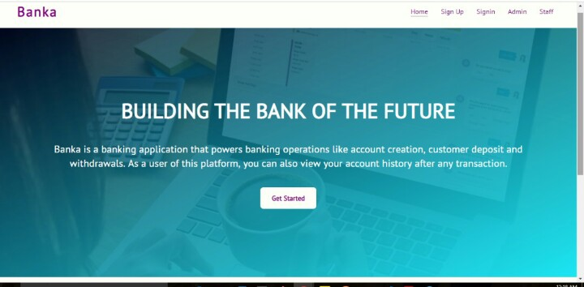

   

# Banka

## Table of Contents

 - [Introduction](#introduction)
 - [Installing](#installing)
 - [Working Routes](#working-routes)

 # Introduction

### Project Overview

**Banka** is a 
light-weight core banking application that powers banking operations like account creation, customer deposit and withdrawals. This app is meant to support a single bank, where users can signup and create bank accounts online, but must visit the branch to withdraw or deposit money.

To get started with this project you need a basic knowledge of :

[Javascript(ES6)](https://es6.io/)

- ### __Style guide__

[Airbnb ](https://github.com/airbnb/javascript)(Javascript style guide)

- ### Useful Links
## Screenshot(UI template)

Preview UI templates : [Github Pages](https://onyimatics.github.io/Banka/)

View Project Management: [Pivotal Tracker](https://www.pivotaltracker.com/n/projects/2320392)

Deployed to Heroku: [Heroku](https://bankaapp.herokuapp.com/)

- ### Technology Stack
1. HTML & CSS
2. Javascript

## Required Features

1. `User (client) can sign up.`
2. `User (client) can login.`
3. `User (client) can create an account.`
4. `User (client) can view account transaction history.`
5. `User (client) can view a specific account transaction.`
6. `Staff (cashier) can debit user (client) account.`
7. `Staff (cashier) can credit user (client) account.`
8. `Admin/staff can view all user accounts.`
9. `Admin/staff can view a specific user account.`
10. `Admin/staff can activate or deactivate an account.`
11. `Admin/staff can delete a specific user account.`
12. `Admin can create staff and admin user accounts.`
13. `User can reset password.`
14. `User can upload a photo to their profile.`

# Installing

#### Prerequisites

Ensure you have **NodeJS** installed by entering `node -v` on your terminal.
If you don't have **NodeJS** installed, go to the [NodeJS Website](http://nodejs.org),  and follow the download instructions

To install this app

- `
git clone https://github.com/Onyimatics/Banka.git
`

- To  install all the required dependencies, on your terminal run

`npm install` 

- To run server,

`npm run start:dev`

- Server listens on port `3000`

## Running the tests

- To run test cases

`
npm run test
`
# Working Routes

 ## *API Endpoints*
|Endpoint                                           | Functionality                     |HTTP method 
|---------------------------------------------------|:-----------------------------------:|-------------:
|/api/v1/                                |Welcome to Banka API        |POST
|/api/v1/auth/signup                               |Sign up a new user         |POST
|/api/v1/auth/signin                               |Sign in an existing user        |POST 
|/api/v1/accounts                               |Create bank account        |POST 
|/api/v1/accounts/*account-number*                    |Admin/Staff can activate or deactivate an account|PATCH
|/api/v1/transactions/*account-number*             |Admin/Staff can delete an account             |DELETE
|/api/v1/transactions/*account-number*/debit             |Staff (cashier) can credit an account              |POST
|/api/v1/transactions/*account-number*/credit              |Staff (cashier) can debit an account     |POST

## Acknowledgments :

- [Andela Home Study](https://homestudy.andela.com/)
- [Google Search](https://google.com)
- [MDN](https://developer.mozilla.org/en-US/)
- [w3schools](https://www.w3schools.com/)
- [Devdocs](https://devdocs.io/)
- [Stackoverflow](stackoverflow.com)
